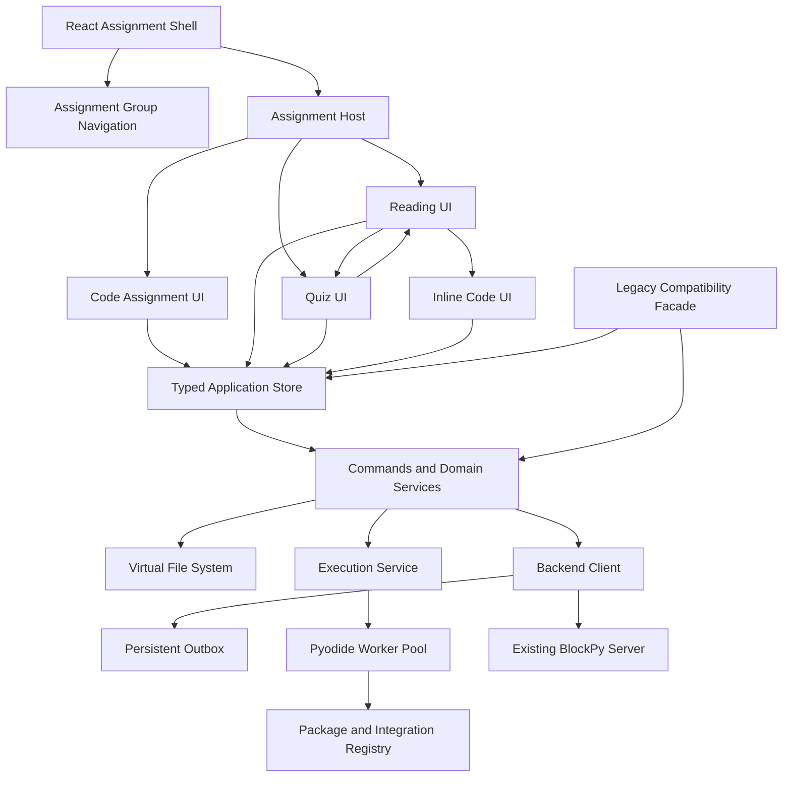
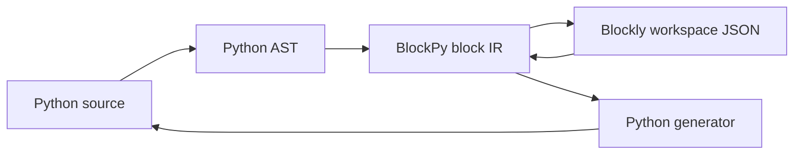
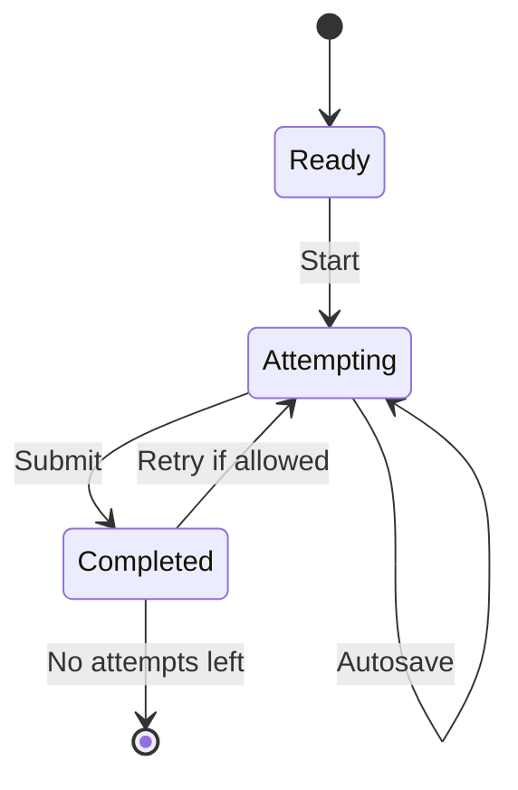

# BlockPy Studio

## Functional and Technical Specification for a TypeScript/React Rewrite

**Document status:** Proposed implementation specification  
**Version:** 0.9  
**Date:** 2026-07-10  
**Primary repositories reviewed:** `blockpy-edu/blockpy`, `blockpy-edu/blockpy-server`  
**Normative terms:** **MUST**, **MUST NOT**, **SHOULD**, **SHOULD NOT**, and **MAY** are used as requirements terminology.

---

## 1. Executive summary

BlockPy Studio is a browser-based learning environment for introductory and intermediate Python instruction. It replaces the current Knockout/jQuery/BlockMirror/Skulpt implementation with a TypeScript and React application using:

- the current stable React and TypeScript toolchain;
- CodeMirror 6 for text editing;
- modern Blockly with JSON workspace serialization;
- Pyodide running in Web Workers for local Python execution;
- a typed virtual file system;
- first-class integrations for Pedal, Matplotlib, Drafter, and future Python packages;
- a unified assignment shell supporting coding problems, readings, and quizzes;
- assignment-group navigation at both the top and bottom of each assignment;
- nested assignment content, including readings with embedded quizzes and executable Python blocks;
- a compatibility layer that preserves the existing BlockPy browser API, server endpoint contract, configuration keys, submission formats, and filename-prefix filesystem semantics.

The architecture intentionally separates:

1. **Modern domain and service layers**, which use normalized typed data and do not encode legacy quirks.
2. **Legacy adapters**, which map old globals, observables, payloads, filenames, callbacks, and Deferred-style APIs onto the modern core.
3. **UI and runtime adapters**, which bind React, CodeMirror, Blockly, Pyodide, and library-specific output renderers to the core.

This separation is the central design constraint. The legacy API is a supported boundary, not the internal architecture.

---

## 2. Scope

### 2.1 In scope

BlockPy Studio MUST provide:

1. A full Python coding assignment environment with:
    - text, blocks, and split views;
    - synchronized Python source and Blockly workspace state;
    - multiple files;
    - run, stop, reset, evaluate, feedback, history, upload, and download workflows;
    - local execution in Pyodide;
    - stdin/stdout/stderr;
    - structured display output;
    - execution tracing and line highlighting where enabled;
    - instructor feedback through Pedal-compatible scripts.

2. A reading environment with:
    - Markdown content;
    - trusted, sanitized instructor HTML compatibility;
    - images, downloadable resources, video, YouTube, alternate media/voice choices, summaries, and headers;
    - reading activity logging;
    - reading completion behavior;
    - optional timer/start controls;
    - inline executable/editable Python code blocks.

3. A quiz environment with:
    - all currently represented legacy question types;
    - attempt state, limits, feedback modes, pools, deterministic randomization, and reading preambles;
    - debounced autosave;
    - local Pyodide preprocessing of answers before any server-bound quiz snapshot;
    - legacy quiz instruction and submission JSON compatibility.

4. Assignment-group navigation with:
    - First, Back, Select, Next, and Last controls;
    - identical controls at the top and bottom of the assignment;
    - completion indicators;
    - hidden/secret completion behavior;
    - subordinate/nested assignment handling;
    - timer and elapsed-time displays;
    - SPA navigation with full-page fallback.

5. Compatibility with the current BlockPy server contract, including:
    - endpoint names and payload fields;
    - URL-encoded and multipart request formats;
    - bearer token support;
    - autosave and retry behavior;
    - assignment and submission object shapes;
    - legacy configuration names;
    - browser globals and the `blockpy.BlockPy` constructor;
    - callable observable-like model properties;
    - legacy component methods used by the current server frontend.

### 2.2 Out of scope for the first production release

The following are not required for initial parity unless separately commissioned:

- a full rewrite of the BlockPy server backend;
- collaborative real-time editing;
- a general-purpose package repository;
- secure client-side hidden grading;
- Java assignment support;
- replacement of the LMS/LTI server integration;
- pixel-identical reproduction of Bootstrap styling;
- preservation of undocumented jQuery DOM manipulation outside the compatibility hooks listed in this document.

### 2.3 Compatibility principle

When legacy behavior conflicts with a cleaner architecture:

- the external observable behavior MUST be preserved when relied upon by existing integrations;
- the internal implementation SHOULD use a normalized model;
- a named compatibility adapter MUST perform the translation;
- known legacy bugs are not automatically requirements, but parsing and loading SHOULD be permissive enough to accept data emitted by them.

---

## 3. Product model

### 3.1 Assignment kinds

The core product model recognizes three assignment kinds:

```ts
export type AssignmentKind = "code" | "reading" | "quiz";
```

Legacy types MUST map as follows:

| Legacy type             |   Core kind | Required behavior                                              |
| ----------------------- | ----------: | -------------------------------------------------------------- |
| `blockpy`               |      `code` | Full Python learning environment                               |
| `reading`               |   `reading` | Reading renderer                                               |
| `textbook`              |   `reading` | Compatibility alias, using a renderer plugin if format differs |
| `quiz`                  |      `quiz` | Quiz renderer                                                  |
| `maze`                  |   extension | Optional plugin or explicit unsupported state                  |
| `typescript` / `kettle` |   extension | Optional plugin                                                |
| `explain`               |   extension | Optional plugin                                                |
| `java`                  | unsupported | Render an explicit migration message                           |

Unknown types MUST not crash navigation. They MUST render a typed unsupported-assignment panel and preserve navigation.

### 3.2 Core records

```ts
export interface AssignmentRecord {
    id: number;
    version: number | string | null;
    name: string;
    url: string;
    legacyType: string;
    kind: AssignmentKind | "extension" | "unsupported";
    instructions: string;
    settingsRaw: string;
    settings: AssignmentSettings;
    points: number;
    hidden: boolean;
    reviewed: boolean;
    public: boolean;
    ipRanges?: string;
    startingCode: string;
    onRun: string;
    onChange?: string;
    onEval?: string;
    tags?: unknown;
    sampleSubmissions?: unknown;
    extraStartingFiles: LegacyFileRecord[];
    extraInstructorFiles: LegacyFileRecord[];
}

export interface SubmissionRecord {
    id: number | null;
    assignmentId: number;
    userId: number | null;
    code: string;
    extraFiles: LegacyFileRecord[];
    score: number;
    correct: boolean;
    submissionStatus: number | string | null;
    dateStarted?: string | null;
    timeLimit?: string | null;
    revision?: string | number | null;
}

export interface AssignmentEnvelope {
    assignment: AssignmentRecord;
    submission: SubmissionRecord | null;
    serverMetadata?: Record<string, unknown>;
}
```

The `settingsRaw` field MUST be retained exactly so invalid or unknown settings are not destroyed by an instructor edit. Parsed settings MUST retain unknown keys through a round trip.

### 3.3 Application contexts

A BlockPy page MAY host multiple assignment contexts:

- one primary assignment;
- a reading preamble nested inside a quiz;
- a quiz nested below a reading;
- multiple inline code editors inside a reading.

Each context MUST have a stable `contextId` and MUST not overwrite another context's editor, VFS, execution, autosave, or lifecycle state.

```ts
export interface AssignmentContext {
    contextId: string;
    assignmentId: number;
    submissionId: number | null;
    partId: string | null;
    role: "primary" | "preamble" | "child" | "inline-code";
    readOnly: boolean;
}
```

---

## 4. Architectural overview

### 4.1 Logical architecture



### 4.2 Package boundaries

A monorepo SHOULD use the following boundaries:

```text
apps/
  blockpy-web/                 React application and route shell
packages/
  core/                        Domain types, reducers, commands, selectors
  backend-legacy/              Existing server HTTP contract
  legacy-compat/               UMD/global API and observable façade
  vfs/                         Typed filesystem and legacy path codec
  editor-text/                 CodeMirror integration
  editor-blocks/               Blockly integration and conversion pipeline
  editor-python/               Dual-mode Python workspace orchestration
  runtime-protocol/            Worker message types
  runtime-pyodide/             Worker implementation and runtime manager
  integration-pedal/
  integration-matplotlib/
  integration-drafter/
  content-reading/
  assessment-quiz/
  assignment-navigation/
  persistence/                 IndexedDB caches and outbox
  test-contracts/              Legacy fixtures and differential tests
```

Package dependencies MUST be acyclic. `legacy-compat` MAY depend on all public service interfaces but the core MUST NOT depend on `legacy-compat`.

### 4.3 Technology policy

The implementation MUST:

- use TypeScript with `strict`, `noUncheckedIndexedAccess`, and exact optional-property checking;
- use React function components and hooks;
- use ES modules internally;
- produce both an ESM package and a legacy UMD compatibility bundle;
- use CodeMirror 6's immutable state/transaction model;
- use Blockly JSON serialization for new persisted workspace state;
- run Pyodide in module Web Workers;
- use schema validation at every server and worker boundary;
- pin exact dependency versions in the lockfile;
- update dependency versions through an automated test and review process rather than hard-coding this specification to a transient version number.

### 4.4 State ownership

State MUST be divided into:

1. **Domain state** — assignments, submissions, files, execution status, navigation, quiz answers.
2. **Remote request state** — endpoint status, retries, errors, stale-response tokens.
3. **Ephemeral view state** — panel sizes, active tabs, editor selections, expanded controls.
4. **Durable local state** — outbox, workspace JSON cache, unsent edits, user preferences.

The recommended domain store is Redux Toolkit or an equivalent store with:

- immutable updates;
- serializable state;
- selector subscriptions;
- listener middleware;
- time-travel-friendly action logs in development.

The specification does not permit business state to live solely inside mounted React components.

### 4.5 Dependency injection

Services MUST be provided through a typed application container:

```ts
export interface BlockPyServices {
    backend: BackendClient;
    vfsFactory: VfsFactory;
    execution: ExecutionService;
    packages: PackageRegistry;
    persistence: PersistenceService;
    logger: EventLogger;
    clock: Clock;
    ids: IdGenerator;
}
```

Tests MUST be able to supply in-memory versions of every service.

---

## 5. Assignment shell and navigation

### 5.1 Shell layout

The primary page MUST render:

1. Top assignment-group navigation.
2. Assignment title/status region.
3. Assignment content host.
4. Bottom assignment-group navigation.

Top and bottom navigation MUST be two views over one controller. They MUST remain synchronized without querying or modifying each other's DOM.

### 5.2 Group manifest

```ts
export interface AssignmentGroupManifest {
    groupId: number | null;
    items: AssignmentGroupItem[];
    currentAssignmentId: number;
    completionIsSecret: boolean;
    estimateSeconds?: number | null;
    timeLimit?: TimeLimitDescriptor | null;
}

export interface AssignmentGroupItem {
    assignmentId: number;
    name: string;
    kind: AssignmentKind | "extension" | "unsupported";
    legacyType: string;
    url?: string;
    subordinate: boolean;
    parentAssignmentId?: number | null;
    completion: "correct" | "incorrect" | "unknown" | "secret";
    hidden: boolean;
}
```

### 5.3 Primary navigation list

The primary navigation sequence MUST exclude subordinate items. This preserves the existing behavior that rejects subordinate assignments from the selector.

When `parentAssignmentId` is unavailable, the compatibility adapter MUST attach a subordinate item to the nearest preceding non-subordinate item. If no preceding parent exists, it MUST remain hidden from primary navigation and be reported as an orphan in diagnostics.

### 5.4 Controls

Both navigation bars MUST provide:

- **First** — select the first primary item;
- **Back** — select the preceding primary item;
- **Select** — choose any primary item;
- **Next** — select the following primary item;
- **Last** — select the last primary item.

First and Back MUST be disabled on the first item. Next and Last MUST be disabled on the last item.

Navigation MUST be keyboard accessible. The select control MUST have an accessible label that includes assignment position and group name when known.

### 5.5 SPA and URL fallback

The navigation controller MUST support:

```ts
export type NavigationMode = "spa" | "document";

export interface AssignmentNavigator {
    goTo(id: number, cause: NavigationCause): Promise<void>;
    first(): Promise<void>;
    back(): Promise<void>;
    next(): Promise<void>;
    last(): Promise<void>;
}
```

In SPA mode:

- a navigation request MUST flush or durably enqueue pending edits;
- the prior load MUST be abortable;
- a stale response MUST NOT replace a more recently selected assignment;
- browser history SHOULD be updated;
- focus SHOULD move to the new assignment heading.

If the assignment cannot be loaded by the SPA client, navigation MUST fall back to the server-provided URL.

### 5.6 Completion display

When any group assignment is secretive/hidden, the group MUST:

- show `??` instead of a numeric completion count;
- omit correctness symbols from selector items;
- avoid changing a secret item to visibly correct when `markCorrect` is called.

Otherwise:

- a newly correct item MUST receive a check mark;
- completion count MUST increase only on the transition from non-correct to correct;
- the Next button MAY receive a transient success emphasis.

### 5.7 Selector expansion preference

The modern preference key SHOULD be namespaced, but the compatibility layer MUST read and write the existing key:

```text
blockpy_assignmentSelectorExpanded
```

The expanded selector SHOULD show up to five visible rows, matching existing behavior.

### 5.8 Timed assignment behavior

The shell MUST support:

- an elapsed-time display;
- a remaining-time display;
- a pre-start state in which navigation can be hidden or disabled;
- an expired state that prevents further mutation;
- server-driven or local timer reconciliation;
- instructor bypass behavior.

Timer state MUST be modeled, not implemented through direct DOM hiding.

### 5.9 Legacy navigation hooks

The compatibility bundle MUST expose or honor:

- `altAssignmentChangingFunction`;
- `markCorrect(assignmentId)`;
- `loadNavigation()`, when the existing template still invokes it;
- URL maps supplied by the server template.

These hooks MUST delegate to the modern navigation controller.

---

## 6. Assignment composition and nesting

### 6.1 Composition tree

Assignments MUST be renderable as a tree:

```ts
export interface AssignmentCompositionNode {
    key: string;
    assignmentId: number;
    role: "primary" | "preamble" | "child";
    children: AssignmentCompositionNode[];
}
```

Supported compositions include:

1. A reading as the primary assignment with one or more quizzes rendered below it.
2. A quiz as the primary assignment with a reading preamble rendered above it.
3. A reading containing multiple inline code editors.
4. A nested child assignment that is subordinate and therefore absent from group navigation.

### 6.2 Relationship resolution

Relationships MUST be resolved in this priority order:

1. Explicit modern `parentAssignmentId`.
2. Explicit quiz `readingId`.
3. Explicit reading `children` setting.
4. Legacy subordinate inference by ordering.
5. No relationship.

Cycles MUST be detected and broken with a visible diagnostic for instructors and a safe student-facing error.

### 6.3 Nested context rules

A nested assignment:

- MUST NOT render group navigation;
- MUST use the parent shell's backend client and authentication;
- MUST have its own assignment/submission state;
- MUST not replace `$MAIN_BLOCKPY_EDITOR`;
- MAY be added to `$ALL_BLOCKPY_EDITORS` if it is a coding context;
- MUST not start duplicate global time-check intervals;
- MUST specify whether its completion affects the parent, itself, or neither.

### 6.4 Reading-quiz completion

The default completion policy is:

- reading completion is recorded for the reading assignment;
- quiz completion is recorded for the quiz assignment;
- a parent reading is not automatically made correct by a child quiz unless server configuration explicitly requests aggregation;
- group navigation displays only top-level completion unless the server provides a composite status.

---

## 7. Coding assignment interface

### 7.1 Full layout

A full coding assignment SHOULD contain:

- instructions panel;
- file selector;
- editor toolbar;
- text/block/split editor region;
- run/stop controls;
- console and input queue;
- feedback panel;
- optional trace/state explorer;
- optional history panel;
- instructor-only file and settings controls.

The layout MUST support desktop, narrow, embedded, and small-layout contexts without creating separate editor implementations.

### 7.2 Toolbar requirements

The toolbar MUST support, subject to settings and role:

- Run / Stop;
- Run without feedback;
- Blocks / Split / Text;
- Reset;
- Import datasets;
- Upload;
- Download;
- History;
- Save;
- Delete;
- Evaluate / interactive console;
- screenshot/export blocks where supported.

### 7.3 Editor modes

```ts
export type PythonEditorMode = "block" | "split" | "text";
```

- `start_view` MUST select the initial mode.
- If blocks are disabled, mode MUST resolve to text.
- Non-`answer.py` Python files SHOULD open in text mode.
- Returning to `answer.py` SHOULD restore its prior mode.
- Small-layout inline editors default to text unless configured otherwise.
- Mode changes MUST not alter Python semantics.

### 7.4 Read-only rules

A file or editor MUST become read-only when any applicable rule is true:

- page is globally read-only;
- assignment setting disables editing;
- assignment requires upload-only submission;
- file namespace is read-only/instructor-only for the current role;
- history mode is active;
- timer has expired;
- quiz attempt is not active, for quiz answer controls.

The UI MUST communicate why editing is disabled.

### 7.5 Reset behavior

Reset MUST be explicit about scope:

```ts
export type ResetScope =
    | "current-file-to-start"
    | "all-student-files-to-start"
    | "execution-only"
    | "workspace-layout";
```

The legacy Reset button maps to `current-file-to-start` for `answer.py`, plus clearing generated files and execution output as current behavior requires. Destructive resets MUST be confirmable and undoable locally until a save occurs.

### 7.6 History

History MUST load server revisions through the existing history endpoint. Viewing history MUST not mutate the active submission. Restoring a revision MUST create a new current edit and save it through the normal autosave path.

---

## 8. Text editor specification

### 8.1 CodeMirror integration

The text editor MUST use CodeMirror 6 and treat the CodeMirror document as a view over the canonical file text in the domain store.

Each editor instance MUST:

- create an `EditorState` from the current file revision;
- dispatch transactions for user and programmatic edits;
- tag programmatic synchronization transactions so they do not create feedback loops;
- destroy its `EditorView` on unmount;
- preserve selection when compatible with an external update;
- use compartments or equivalent reconfiguration for read-only state, keymaps, themes, linting, and language services.

### 8.2 Python language support

The Python editor MUST provide:

- syntax highlighting;
- indentation;
- bracket matching;
- search;
- undo/redo;
- line numbers;
- diagnostics;
- line decorations for errors, trace position, and uncovered lines;
- configurable tab behavior using spaces;
- protection from accidental overwrite mode;
- accessible keyboard operation.

### 8.3 Source updates

Every source mutation MUST carry metadata:

```ts
export interface SourceEdit {
    contextId: string;
    fileId: string;
    baseRevision: number;
    origin:
        | "codemirror"
        | "blockly"
        | "reset"
        | "history-restore"
        | "legacy-api"
        | "remote-load";
    text: string;
    timestamp: number;
}
```

Edits based on stale revisions MUST be merged, rejected, or surfaced as conflicts; they MUST NOT silently overwrite newer text.

### 8.4 Diagnostics

Diagnostics MUST use a shared format:

```ts
export interface Diagnostic {
    severity: "error" | "warning" | "info";
    source: "parser" | "runtime" | "pedal" | "conversion" | "system";
    message: string;
    file: string;
    from?: { line: number; column: number };
    to?: { line: number; column: number };
    code?: string;
    data?: unknown;
}
```

Runtime and instructor-code line offsets MUST be translated before display.

---

## 9. Blockly and dual-representation synchronization

### 9.1 Canonical representation

**Python text is the canonical semantic representation.**

Blockly workspace JSON is a persisted editing representation, not the authoritative submission format. The server-compatible submission remains Python source.

This requirement prevents workspace metadata from replacing or corrupting source that cannot be represented as blocks.

### 9.2 Conversion pipeline



The block IR MUST be independent of Blockly's concrete object model. This permits migration of Blockly versions and unit testing without a DOM.

### 9.3 Synchronization state machine

```ts
export type DualEditorSyncState =
    | "clean"
    | "text-dirty"
    | "blocks-dirty"
    | "converting-text"
    | "converting-blocks"
    | "unrepresentable"
    | "conflict"
    | "error";
```

Rules:

- A user edit in text sets `text-dirty`.
- After a debounce or mode transition, text is parsed and converted.
- A user block edit sets `blocks-dirty`.
- Generated Python is applied as one tagged transaction.
- Programmatic updates MUST NOT be interpreted as user edits.
- Simultaneous pending changes MUST enter `conflict`; one side MUST NOT silently win.
- Conversion failures MUST preserve the last valid source and workspace.

### 9.4 Unsupported Python

The converter MUST support one or both strategies:

1. **Raw-code blocks** that preserve unsupported source verbatim.
2. **Text-only fallback** with a clear unrepresentable-state message.

It MUST NOT delete unsupported statements merely to produce a valid workspace.

### 9.5 Workspace persistence

New workspace persistence MUST use Blockly JSON serialization. Workspace state MAY be stored:

- in IndexedDB keyed by assignment, submission, part, file, and source hash;
- in a future server-side metadata field;
- in an instructor export.

The server-compatible Python source MUST remain sufficient to load the assignment. A missing or invalid workspace cache MUST be recoverable by converting the Python source.

### 9.6 Toolbox

Toolboxes MUST be supplied through a typed registry:

```ts
export interface ToolboxProvider {
    resolve(
        nameOrDefinition: string | object,
        context: ToolboxContext,
    ): Promise<Blockly.utils.toolbox.ToolboxDefinition>;
}
```

Legacy values such as `normal`, `minimal`, `empty`, and `custom` MUST be supported. `custom` MUST read the legacy `?toolbox.blockpy` file and parse JSON. Invalid custom toolboxes MUST fall back to a safe minimal toolbox and produce an instructor diagnostic.

### 9.7 Screenshots

A block screenshot API MUST remain available. It MAY use SVG serialization and canvas conversion. The compatibility API MUST continue to support:

```ts
blockEditor.getPngFromBlocks((pngData, imageElement) => { ... });
```

---

## 10. Virtual file system

### 10.1 Design objective

The VFS MUST preserve every externally visible legacy filename behavior while using explicit metadata internally.

A prefix is not a namespace internally. It is parsed into a namespace descriptor at the compatibility boundary.

### 10.2 Internal entry model

```ts
export type FileNamespace =
    | "student"
    | "starting"
    | "instructor"
    | "hidden"
    | "readonly"
    | "secret"
    | "generated"
    | "bundle"
    | "remote";

export interface VfsEntry {
    id: string;
    contextId: string;
    path: string;
    legacyName: string;
    namespace: FileNamespace;
    mediaType: string;
    contents: string | Uint8Array;
    owner: "assignment" | "submission" | "runtime" | "remote";
    visibility: "student" | "instructor" | "none";
    mutability: "editable" | "readonly" | "system";
    persistence: "submission" | "assignment" | "session" | "none";
    lifecycle: "durable" | "resettable" | "generated" | "remote-cache";
    revision: number;
    sourceUrl?: string;
}
```

### 10.3 Legacy prefix mapping

| Prefix | Internal namespace |               Student UI |            Student Python |                Instructor | Lifecycle               |
| ------ | ------------------ | -----------------------: | ------------------------: | ------------------------: | ----------------------- |
| none   | `student`          | visible when files shown |                accessible |                accessible | submission              |
| `^`    | `starting`         |                   hidden |            not by default |                accessible | reset template          |
| `!`    | `instructor`       |                   hidden |                 forbidden |                accessible | assignment              |
| `?`    | `hidden`           |                   hidden |                accessible |                accessible | assignment              |
| `&`    | `readonly`         |    visible, non-editable |                accessible |                accessible | assignment              |
| `$`    | `secret`           |                   hidden |  not generally searchable | controlled service access | assignment              |
| `*`    | `generated`        | visible where applicable | accessible and may shadow |                accessible | cleared on engine reset |
| `#`    | `bundle`           |      not a real file tab |   not directly accessible |     serialization adapter | transport               |
| remote | `remote`           |   depends on mapped name |                accessible |                accessible | cache                   |

### 10.4 Required special files

The adapter MUST recognize at least:

```text
answer.py
!instructions.md
!assignment_settings.blockpy
^starting_code.py
!on_run.py
!on_change.py
!on_eval.py
!sample_submissions.blockpy
!tags.blockpy
!answer_prefix.py
!answer_suffix.py
?mock_urls.blockpy
?toolbox.blockpy
$settings.blockpy
#extra_student_files.blockpy
#extra_starting_files.blockpy
#extra_instructor_files.blockpy
images.blockpy
```

The misspelled/older alias `!assignment_settings.py` MUST be accepted when encountered.

### 10.5 Search modes

```ts
export type FileSearchMode = "student" | "everywhere" | "instructor-first";
```

For a normal name `x`, resolution MUST follow the current precedence:

**Student search**

```text
?x -> &x -> x -> *x -> remote x
```

**Instructor/everywhere search**

```text
&x -> x -> *x -> !x -> ?x -> ^x -> remote x
```

**`_instructor/` search**

```text
!x -> ?x -> ^x -> &x -> x -> *x -> remote x
```

**`_student/` search**

Use student search regardless of caller role.

A leading `./` MUST be ignored.

### 10.6 Special path resolution

The runtime adapter MUST map:

| Runtime path                   | Backing entry                 |
| ------------------------------ | ----------------------------- |
| `answer.py` or `./answer.py`   | current composed student code |
| `_instructor/on_run.py`        | `!on_run.py`                  |
| `_instructor/on_change.py`     | `!on_change.py`               |
| `_instructor/on_eval.py`       | `!on_eval.py`                 |
| `_instructor/instructions.md`  | `!instructions.md`            |
| `_instructor/starting_code.py` | `^starting_code.py`           |

Student execution MUST reject direct instructor paths and Pedal/utility internals that are designated instructor-only.

### 10.7 Student code composition

Before student execution, `answer.py` MUST be composed as:

```text
contents(!answer_prefix.py)
+ contents(answer.py)
+ contents(!answer_suffix.py)
```

Missing prefix/suffix files contribute an empty string. Newline normalization MUST prevent accidental token concatenation.

### 10.8 Reset semantics

Resetting student files MUST:

- restore `answer.py` from `^starting_code.py`;
- restore each named student file from its corresponding starting entry where defined;
- remove generated `*` entries;
- preserve instructor, hidden, read-only, and remote entries;
- emit file-change events.

### 10.9 Concatenated bundle compatibility

The decoder for `#extra_*` files MUST accept:

1. a JSON object mapping filenames to contents;
2. an array of `{filename, contents}` records;
3. an empty string or null;
4. already-parsed equivalents.

The canonical legacy encoder MUST emit an object map unless a server capability explicitly requires the array form.

### 10.10 Remote files

Remote files MUST be represented as entries with a `sourceUrl` and lazy or eager loading state. `preload_files` and `preload_all_files` MUST be supported. A runtime file sync MUST await required remote files or return a clear `FileNotFoundError`.

### 10.11 VFS API

```ts
export interface VirtualFileSystem {
    list(filter?: VfsFilter): readonly VfsEntry[];
    stat(name: string): VfsEntry | undefined;
    read(name: string, mode: FileSearchMode): Promise<string | Uint8Array>;
    write(name: string, contents: string | Uint8Array, actor: FileActor): void;
    create(input: CreateFileInput): VfsEntry;
    delete(name: string, actor: FileActor): boolean;
    rename(source: string, destination: string, actor: FileActor): boolean;
    watch(name: string, listener: FileListener): Unsubscribe;
    snapshotForRuntime(role: "student" | "instructor"): RuntimeFileSnapshot;
}
```

Mutability and access policy MUST be enforced in this service, not only in the UI.

---

## 11. Pyodide execution architecture

### 11.1 Worker isolation

Python MUST execute in a module Web Worker. The React main thread MUST never call `runPython` directly.

Benefits required by the design:

- long-running Python does not block the UI;
- the worker has no direct DOM access;
- runtime messages have an explicit serializable protocol;
- a stuck runtime can be terminated and replaced.

### 11.2 Runtime topology

The default topology SHOULD be:

- one warm general-purpose Python worker per page;
- one optional isolated preprocessing worker for quizzes;
- a queue for inline editors;
- a configurable maximum worker count based on device memory.

A low-memory mode MAY use one worker with hard session resets between contexts.

### 11.3 Worker protocol

Every message MUST have a protocol version, request ID, context ID, and session ID.

```ts
export type RuntimeRequest =
    | InitRuntimeRequest
    | PrepareEnvironmentRequest
    | SyncFilesRequest
    | RunStudentRequest
    | RunFeedbackRequest
    | EvaluateRequest
    | PreprocessQuizRequest
    | ResetSessionRequest
    | InterruptRequest
    | DisposeSessionRequest;

export interface RuntimeRequestBase {
    protocol: 1;
    requestId: string;
    contextId: string;
    sessionId: string;
}

export type RuntimeEvent =
    | { type: "ready"; requestId: string }
    | { type: "stdout"; requestId: string; text: string }
    | { type: "stderr"; requestId: string; text: string }
    | {
          type: "stdin-request";
          requestId: string;
          prompt: string;
          token: string;
      }
    | { type: "display"; requestId: string; bundle: MimeBundle }
    | { type: "trace"; requestId: string; event: TraceEvent }
    | { type: "diagnostic"; requestId: string; diagnostic: Diagnostic }
    | { type: "result"; requestId: string; result: ExecutionResult }
    | { type: "error"; requestId: string; error: SerializedRuntimeError }
    | { type: "cancelled"; requestId: string };
```

Responses for stale request IDs MUST be ignored.

### 11.4 Runtime filesystem layout

The VFS MUST be projected into an isolated runtime root:

```text
/workspaces/<contextId>/
  answer.py
  student/
  readonly/
  hidden/
  instructor/
  generated/
  remote/
```

A compatibility import hook MUST reproduce legacy import and `open()` resolution. The physical Emscripten paths do not need to expose prefix syntax.

### 11.5 Execution phases

A standard Run action MUST perform:

1. Flush the active editor transaction.
2. Compose student code with prefix/suffix.
3. Save or enqueue `answer.py`.
4. Log `Compile`/`Run.Program` compatible events.
5. Reset prior output, feedback, trace, and generated files.
6. Synchronize the VFS into the worker.
7. Prepare requested packages.
8. Parse/compile Python.
9. Execute student code.
10. Collect output, errors, globals summary, calls, trace, plots, and display bundles.
11. If feedback is enabled, execute the instructor/Pedal phase.
12. Update local score/correct state.
13. Send the legacy `updateSubmission` payload.
14. Mark the runtime ready.

A Run without feedback MUST omit phase 11 and MUST not submit a new Pedal correctness result.

### 11.6 Cancellation

When cross-origin isolation and `SharedArrayBuffer` are available:

- the worker MUST configure Pyodide's interrupt buffer;
- Stop MUST signal `SIGINT`;
- a grace period MAY allow Python cleanup.

When unavailable or unsuccessful:

- Stop MUST terminate the worker;
- the runtime manager MUST create a fresh worker;
- pending requests MUST resolve as cancelled;
- durable VFS and editor state MUST survive.

### 11.7 Timeouts

Timeouts MUST be implemented by the runtime manager, not by a blocking browser prompt.

Settings MUST support:

- student timeout;
- instructor timeout;
- quiz-preprocessing timeout;
- disabled timeout.

An instructor-configured timeout extension MAY be offered through a modal. Infinite execution MUST remain interruptible by terminating the worker.

### 11.8 Standard streams

The runtime MUST redirect:

- `stdout` to streaming console events;
- `stderr` to error output;
- `stdin` to asynchronous main-thread prompts;
- queued input to deterministic replay during feedback.

Input requests MUST be cancellable. A new run MUST not consume stale input from a prior session.

### 11.9 Evaluation console

After a successful student run, Evaluate mode MUST use a controlled persistent globals namespace for that execution session. Starting a new Run or Reset invalidates the previous evaluation session.

### 11.10 Trace and state explorer

When trace is enabled, the runtime SHOULD use CPython tracing facilities to emit line events for student files. Trace snapshots MUST:

- exclude instructor frames by default;
- serialize values with depth, size, and item limits;
- avoid invoking arbitrary user `__repr__` without protection;
- record line, function, file, event kind, and a safe locals/globals summary;
- support coverage calculation;
- be suppressible for performance.

The exact Skulpt object representation is not a compatibility requirement. The student-visible state-explorer behavior is.

### 11.11 Runtime reset

A hard reset MUST:

- clear user modules from `sys.modules`;
- remove user globals;
- reset stdout/stderr/input;
- close Matplotlib figures;
- clear Drafter routes and app state;
- clear generated files;
- clear Pedal's report;
- restore deterministic random seeds where configured;
- preserve installed package caches.

### 11.12 Security boundary

A Pyodide worker improves isolation but MUST NOT be described as a complete security sandbox.

The implementation MUST:

- never pass access tokens, cookies, instructor secrets, or backend clients into Python globals;
- expose only capability-scoped RPC functions;
- apply a restrictive Content Security Policy;
- restrict worker network destinations;
- disable or wrap unintended network APIs where feasible;
- treat client-side grading and preprocessing code as visible to students;
- keep authoritative secret grading on the server.

---

## 12. Python package and library integrations

### 12.1 Package registry

```ts
export interface PythonPackageDescriptor {
    name: string;
    version: string;
    source:
        | { kind: "pyodide"; package: string }
        | { kind: "wheel"; url: string; sha256: string }
        | { kind: "bundled"; asset: string };
    dependencies?: string[];
    preload?: boolean;
    capabilities?: string[];
}

export interface PackageRegistry {
    resolve(
        imports: string[],
        assignment: AssignmentRecord,
    ): PythonPackageDescriptor[];
    prepare(
        sessionId: string,
        packages: PythonPackageDescriptor[],
    ): Promise<void>;
}
```

Package selection MUST be based on an allowlisted manifest. Arbitrary instructor URLs MUST require an explicit trusted configuration.

### 12.2 Pedal

Pedal integration MUST provide:

- a pinned pure-Python wheel;
- a BlockPy environment adapter compatible with existing `pedal.environments.blockpy` expectations;
- student source and all permitted student-visible files;
- queued input replay;
- optional TIFA;
- sandbox execution;
- deterministic question seed based on submission;
- final feedback resolution;
- positive and system feedback;
- mapping into a typed feedback model.

```ts
export interface PedalFeedbackResult {
    success: boolean;
    score: number;
    category: string;
    title: string;
    message: string;
    data: unknown;
    hideCorrectness: boolean;
    positives: Array<{ title: string; label: string; message: string }>;
    systems: Array<{ label: string; title: string; message: string }>;
    instructions?: string[];
}
```

The score MUST be clamped to `[0, 1]` before legacy submission update unless the backend contract is explicitly upgraded.

### 12.3 Matplotlib

Matplotlib integration MUST:

- install/load the Pyodide-compatible package through the package registry;
- use a non-windowing backend;
- intercept `show()` and end-of-run open figures;
- emit display bundles containing PNG and, where practical, SVG;
- render figures in the output panel;
- close figures on reset;
- enforce output count and byte limits;
- permit Pedal to inspect generated plots where supported.

### 12.4 Drafter

Drafter integration MUST use a browser adapter rather than opening a real listening socket.

The adapter MUST:

1. capture route registration in Python;
2. accept virtual HTTP requests from the React preview;
3. execute the selected route in the worker;
4. serialize Drafter page/component output;
5. render the output through a controlled React renderer;
6. translate links and form submissions into subsequent virtual requests;
7. isolate each execution context's routes and state;
8. display Python route exceptions as runtime diagnostics.

If upstream Drafter cannot run unchanged in Pyodide, the project MUST ship a pinned compatibility wheel or upstream patch. Drafter support is a release gate requiring an implementation spike before parity is declared.

### 12.5 Dataset and CORGIS support

Dataset integrations MUST be implemented as package/file providers rather than globals. Imported datasets MUST be discoverable through:

- assignment settings;
- VFS files;
- package imports;
- a dataset browser action.

Existing `_IMPORTED_DATASETS` and `_IMPORTED_COMPLETE_DATASETS` globals MUST be represented in the compatibility bundle.

### 12.6 Additional display integrations

The runtime display protocol SHOULD support:

```ts
export interface MimeBundle {
    "text/plain"?: string;
    "text/html"?: string;
    "image/png"?: string;
    "image/svg+xml"?: string;
    "application/json"?: unknown;
    "application/vnd.blockpy.drafter+json"?: unknown;
    "application/vnd.blockpy.trace+json"?: unknown;
}
```

HTML from Python MUST be sanitized before insertion.

---

## 13. Reading environment

### 13.1 Reading model

```ts
export interface ReadingSettings {
    header?: string;
    summary?: string;
    slides?: string;
    popout?: boolean;
    youtube?: string | Record<string, string>;
    video?: string | Record<string, string>;
    start_timer_button?: boolean;
    time_limit?: string;
    children?: number[];
    trusted_html?: boolean;
}
```

Unknown settings MUST be retained.

### 13.2 Reading renderer

The renderer MUST:

- parse Markdown into an intermediate syntax tree;
- resolve relative links and images through assignment-file download URLs;
- sanitize all rendered HTML;
- support an allowlisted trusted-instructor HTML mode for legacy readings;
- syntax-highlight code;
- preserve heading anchors;
- support tables, lists, block quotes, and fenced code;
- avoid applying React behavior by scanning and mutating generated DOM after render.

Custom nodes MUST be generated during parsing.

### 13.3 Media

Readings MUST support:

- YouTube embeds;
- hosted video;
- captions;
- selectable alternate voice/media options;
- downloadable slides/resources;
- popout links where permitted.

The user's prior voice choice SHOULD be persisted using the existing preference key where possible.

### 13.4 Reading completion

When a reading is successfully loaded with a submission, the client MUST preserve existing mark-read behavior unless settings specify an alternate rule:

- status `1`;
- correct `true`;
- legacy update-submission request;
- navigation completion update on success.

A nested preamble MAY suppress completion through an explicit `completionPolicy: "none"`.

### 13.5 Activity logging

Reading activity logging MUST include:

- initial load;
- document visibility;
- scroll position and document height;
- estimated progress;
- movement/no-movement;
- video play, pause, seek, end, waiting, rate change, and errors;
- playback time and duration where available.

Logging MUST use a backoff schedule and persistent outbox. It MUST not create one timer per nested component.

### 13.6 Timed readings/exams

A reading MAY require an explicit start action. Before start:

- assignment navigation MAY be hidden/disabled;
- content visibility follows server policy;
- no client-generated start time is authoritative until the server confirms it.

After expiry:

- mutation is disabled;
- a clear blocking message is shown;
- an expiry log is queued;
- server submission behavior follows configured policy.

### 13.7 Inline Python code syntax

The legacy syntax MUST remain accepted:

````markdown
```python part-id
print("Hello")
```
````

The token following `python` is interpreted as `partId`.

A modern explicit form SHOULD also be accepted:

````markdown
```python {part="part-id" run="button" mode="text"}
print("Hello")
```
````

### 13.8 Inline code component

An inline Python fence with a part ID MUST render:

1. static highlighted source;
2. a Run/Edit button;
3. on activation, a small-layout coding environment;
4. output and diagnostics scoped to that block.

The component MUST:

- mount lazily;
- share the page runtime pool;
- have an isolated execution session;
- use the parent assignment and submission identifiers;
- save through `part_id`;
- destroy editor views and subscriptions on unmount;
- retain unsent state in the local durable store;
- support multiple simultaneous blocks without global-state collisions.

### 13.9 Part document codec

Legacy part storage uses headings:

```text
##### Part <partId>
```

The codec MUST implement:

```ts
export interface PartDocumentCodec {
    extract(document: string, partId: string | null): string | null;
    inject(
        document: string,
        partId: string,
        body: string,
        mode: "insert-if-missing" | "overwrite",
    ): string;
    list(document: string): Array<{ partId: string; body: string }>;
}
```

Behavior MUST match legacy edge cases:

- null/empty part ID returns the entire document;
- an absent part returns `null` from extraction;
- insertion appends a new heading/body;
- text before the first part heading is preserved;
- unrelated parts retain order and text;
- a single leading/trailing separator newline is normalized as legacy code does;
- duplicate part IDs produce an instructor diagnostic and use the first occurrence unless a migration repair is requested.

The codec SHOULD use a parser rather than repeated ad hoc regular-expression splitting, but its output must be golden-tested against the legacy implementation.

### 13.10 Inline save concurrency

Inline saves MUST include the current `part_id`. If the server only supports whole-document code, the client MUST use revision-aware read/merge/write. It MUST not overwrite edits from another part based on a stale whole document.

---

## 14. Quiz environment

### 14.1 Legacy quiz instruction schema

The client MUST load and save the existing top-level structure:

```ts
export interface QuizInstructions {
    questions: Record<string, QuizQuestion>;
    settings: QuizSettings;
    pools: QuizPool[];
}

export interface QuizSettings {
    attemptLimit?: number;
    coolDown?: number;
    feedbackType?: "IMMEDIATE" | "NONE" | "SUMMARY";
    questionsPerPage?: number;
    poolRandomness?: "ATTEMPT" | "SEED" | "NONE" | "GROUP";
    readingId?: number | string | null;
    preprocess?: QuizPreprocessDefaults;
}
```

Missing fields MUST receive legacy-compatible defaults. Invalid JSON MUST produce an instructor-editable recovery state and MUST not erase the original text.

### 14.2 Question types

The renderer MUST support:

- `multiple_choice_question`;
- `multiple_answers_question`;
- `true_false_question`;
- `text_only_question`;
- `matching_question`;
- `multiple_dropdowns_question`;
- `short_answer_question`;
- `fill_in_multiple_blanks_question`;
- `numerical_question`;
- `essay_question`.

The following MAY initially use an explicit unsupported control but their data MUST round-trip:

- `calculated_question`;
- `file_upload_question`.

### 14.3 Quiz submission schema

Server-compatible snapshots MUST retain:

```ts
export interface QuizSubmission {
    studentAnswers: Record<string, unknown>;
    attempt: {
        attempting: boolean;
        count: number;
        mulligans?: number;
    };
    feedback: Record<string, QuizFeedback>;
}
```

The payload remains serialized into `answer.py`.

### 14.4 Attempt state machine



The UI MUST enforce:

- attempt limits;
- mulligans;
- cooldown where configured;
- disabled inputs outside an active attempt;
- feedback visibility mode;
- saving indicator;
- retry wording;
- server-reported status/correctness.

### 14.5 Pool selection

Question pools MUST be deterministic.

Seed policy:

- `SEED`: submission-derived stable seed;
- `ATTEMPT`: stable seed plus attempt number;
- `NONE`: fixed canonical choice;
- `GROUP`: group-shared seed supplied by the server, with a documented fallback.

The implementation MUST use a named deterministic PRNG, not `Array.sort(() => Math.random() - 0.5)`.

Only selected/visible questions are included in the server-bound student-answer snapshot unless the legacy assignment explicitly requires all questions.

### 14.6 Reading preamble

`readingId` MAY be:

- a numeric assignment ID;
- an assignment URL string resolved through the assignment store;
- null.

The reading is rendered above the quiz with:

- `role: "preamble"`;
- no group navigation;
- no duplicate timer;
- configurable completion logging;
- a preview status/jump link.

### 14.7 Quiz below a reading

A reading with subordinate quiz children MUST render those quizzes below the reading content. The child quiz MUST retain its own assignment and submission IDs, grading, attempts, and autosave.

### 14.8 Answer preprocessing

#### 14.8.1 Purpose

Quiz answer preprocessing transforms a student's UI answer into a JSON-serializable value before that quiz snapshot is sent to the backend. It is useful for normalization, parsing, structured extraction, or locally computed derived answers.

It is not secret grading. Preprocessor code is delivered to the browser and MUST be treated as visible.

#### 14.8.2 Schema

```ts
export interface QuizAnswerPreprocessor {
    language: "python";
    code: string;
    entrypoint?: string; // default: "preprocess"
    packages?: string[];
    files?: string[];
    timeoutMs?: number;
    onError?: "block-save" | "use-raw" | "use-last-good";
    resultSchema?: JsonSchema;
}

export interface QuizQuestion {
    id?: string;
    title: string;
    body: string;
    type: string;
    points: number;
    answers?: unknown;
    statements?: string[];
    retainOrder?: boolean;
    preprocess?: QuizAnswerPreprocessor | false;
}
```

A quiz-level default MAY be overridden per question.

#### 14.8.3 Python context

The preprocessor receives:

```py
answer       # the current raw answer for this question
answers      # a read-only mapping of all current raw answers
question     # safe question metadata
assignment   # safe assignment metadata
attempt      # attempt number and seed
files        # explicitly allowlisted file contents
```

Recommended contract:

```py
def preprocess(answer, answers, question, assignment, attempt, files):
    return answer
```

If `entrypoint` is omitted and no function is defined, the code MAY assign a JSON-compatible value to `result`.

#### 14.8.4 Execution policy

Preprocessing MUST:

- run in an isolated worker session separate from student code state;
- have no instructor-secret files;
- have no credentials;
- have network disabled;
- use deterministic random seeding;
- apply strict time and output limits;
- destroy Python proxies after conversion;
- validate the result against JSON and any configured schema.

#### 14.8.5 Save policy

Every server-bound quiz snapshot MUST contain preprocessed values.

To avoid excessive execution:

- answer changes are debounced;
- results are cached by hash of raw answer, all relevant answers, code, packages, files, and attempt;
- multiple questions SHOULD be preprocessed in one worker request;
- local raw state is updated immediately;
- autosave waits for current preprocessing or uses the configured error policy;
- final Submit always forces validation of the latest answers.

#### 14.8.6 Raw answer retention

The UI MUST retain raw answers separately from processed wire answers.

Preferred storage:

- raw state in the application store and IndexedDB;
- processed state in `studentAnswers`.

An optional extension field MAY be sent only when the backend advertises support:

```ts
interface ExtendedQuizSubmission extends QuizSubmission {
    clientState?: {
        rawAnswers?: Record<string, unknown>;
        preprocessVersion?: string;
    };
}
```

Without capability support, no new top-level fields are sent.

#### 14.8.7 Errors

A preprocessing failure MUST produce a question-scoped diagnostic. The default policy is `block-save`. An instructor MAY configure `use-raw` or `use-last-good`, but the UI MUST visibly indicate that fallback occurred.

Preprocessor errors SHOULD be logged with:

- assignment and question ID;
- code version/hash;
- error class and sanitized message;
- elapsed time;
- fallback policy.

### 14.9 Quiz submit

Submit MUST:

1. flush input controls;
2. preprocess and validate all visible answers;
3. save the final legacy `answer.py` JSON;
4. call the legacy update-submission endpoint;
5. incorporate returned feedbacks;
6. update submission status;
7. end the attempt;
8. call `markCorrect` when appropriate.

Double submission MUST be prevented by request identity and UI state.

---

## 15. Backend compatibility contract

### 15.1 Transport adapter

The modern `BackendClient` SHOULD expose Promises and typed DTOs. A `LegacyBlockPyServer` façade MUST preserve callback and Deferred conventions.

```ts
export interface BackendClient {
    loadAssignment(
        request: LoadAssignmentRequest,
    ): Promise<LoadAssignmentResponse>;
    saveFile(request: SaveFileRequest): Promise<ServerResponse>;
    saveAssignment(request: SaveAssignmentRequest): Promise<ServerResponse>;
    updateSubmission(
        request: UpdateSubmissionRequest,
    ): Promise<UpdateSubmissionResponse>;
    updateSubmissionStatus(
        request: UpdateStatusRequest,
    ): Promise<ServerResponse>;
    logEvent(request: LogEventRequest): Promise<ServerResponse>;
    loadHistory(request: HistoryRequest): Promise<HistoryResponse>;
    listUploadedFiles(request: ListFilesRequest): Promise<ListFilesResponse>;
    uploadFile(request: UploadFileRequest): Promise<ServerResponse>;
    downloadFile(request: DownloadFileRequest): Promise<ArrayBuffer | string>;
    renameFile(request: RenameFileRequest): Promise<ServerResponse>;
    saveImage(request: SaveImageRequest): Promise<ServerResponse>;
}
```

### 15.2 Common legacy fields

Every applicable request MUST include exact legacy names:

```ts
export interface LegacyServerContext {
    assignment_id: number | null;
    assignment_group_id: number | null;
    course_id: number | null;
    submission_id: number | null;
    user_id: number | null;
    version: number | string | null;
    timestamp: number; // Unix epoch milliseconds
    timezone: number; // Date.getTimezoneOffset(), minutes
    passcode: string | null;
    part_id: string | null;
}
```

Undefined values MUST be encoded consistently with the existing server's accepted behavior.

### 15.3 Endpoint URL keys

The configuration adapter MUST recognize:

```text
importDatasets
loadAssignment
instructionsAssignmentSetup
forkAssignment
downloadFile
saveAssignment
loadHistory
logEvent
saveFile
saveImage
listUploadedFiles
uploadFile
renameFile
updateSubmission
updateSubmissionStatus
openaiProxy
shareUrl
```

It SHOULD also recognize older aliases such as `load_file`.

### 15.4 Request formats

- Normal legacy POSTs use `application/x-www-form-urlencoded` unless the endpoint is configured otherwise.
- Upload/download/rename operations using binary or file values use `FormData`.
- An `access_token` MUST produce `Authorization: Bearer <token>`.
- Read-only mode MUST suppress mutating requests and set endpoint status to offline/read-only.

### 15.5 File save

`saveFile` MUST send:

```ts
{
  ...context,
  filename: string,
  code: string
}
```

Autosave coalescing key MUST include assignment, submission, part ID, and filename.

### 15.6 Submission update

Coding assignment update MUST support:

```ts
{
  ...context,
  score: number,
  correct: boolean,
  hidden_override: boolean,
  force_update: boolean,
  image?: string
}
```

Quiz and reading workflows MAY use legacy status/correct fields as currently expected by the server. The adapter MUST not assume one uniform backend interpretation across all assignment types.

### 15.7 Assignment save

The adapter MUST preserve fields such as:

```text
hidden
reviewed
public
url
points
ip_ranges
name
settings
```

Settings MUST use server snake_case names.

### 15.8 Event logging

Event payloads MUST support:

```ts
{
  ...context,
  event_type: string,
  category?: string,
  label?: string,
  message?: string,
  file_path?: string
}
```

The existing event names SHOULD be preserved where equivalent, including:

```text
Compile
Compile.Error
Run.Program
Session.Start
Session.End
Resource.View
X-Instructions.Change
X-File.Upload
X-File.Download
X-IP.Change
```

### 15.9 Retry and offline outbox

The persistence layer MUST provide:

- latest-write-wins coalescing for file and assignment saves;
- FIFO queues for log events and submission updates;
- durable IndexedDB storage;
- endpoint status: `ready`, `active`, `retrying`, `failed`, `offline`;
- bounded queues compatible with existing limits (at least 200 logs and 50 submission updates);
- exponential or bounded linear backoff with jitter;
- duplicate suppression;
- manual retry and export for unrecoverable records.

A newer save MUST supersede an older pending save for the same coalescing key.

### 15.10 Response validation

All responses MUST be validated. The client MUST tolerate legacy variants where an error message is either a string or nested object. Validation failure MUST preserve raw response data in diagnostics without exposing sensitive fields to students.

---

## 16. Legacy browser API

### 16.1 Distribution

The project MUST publish:

1. An ESM API for the new application.
2. A UMD bundle exposing `window.blockpy`.
3. Type declarations for both.

The following MUST work:

```js
const editor = new blockpy.BlockPy(configuration, assignment, submission);
```

### 16.2 Constructor configuration

The constructor MUST accept:

- dotted keys such as `user.id`;
- snake_case assignment settings nested under `assignment.settings.*`;
- booleans supplied as booleans or `"true"`/`"false"` strings where legacy code does so;
- `attachment.point` as selector, HTMLElement, jQuery object, or compatible wrapper;
- URL map under `urls`;
- callbacks under `callback.success`;
- `partId`;
- `access_token`.

Unknown configuration keys MUST be retained and exposed to `getSetting`.

### 16.3 Required class surface

The compatibility class MUST provide:

```ts
class BlockPy {
    model: LegacyModelFacade;
    components: LegacyComponentsFacade;
    utilities: LegacyUtilitiesFacade;

    constructor(
        configuration: object,
        assignment?: object,
        submission?: object,
    );

    getSetting(key: string, defaultValue?: unknown): unknown;
    loadAssignment(id: number): LegacyDeferred<unknown>;
    loadAssignmentData_(data: unknown): void;
    show(): void;
    hide(): void;
    start(): void;
    resetInterface(): void;
    requestPasscode(): void;
    destroy(): void;
}
```

`destroy()` MUST be fully implemented and idempotent.

### 16.4 Deferred compatibility

Legacy asynchronous methods MUST return a thenable with:

```ts
interface LegacyDeferred<T> extends PromiseLike<T> {
  done(callback: (value: T) => void): LegacyDeferred<T>;
  fail(callback: (...args: unknown[]) => void): LegacyDeferred<T>;
  always(callback: () => void): LegacyDeferred<T>;
  then<TResult1 = T, TResult2 = never>(...): Promise<TResult1 | TResult2>;
}
```

This permits the current server template's `.done(...)` calls without requiring jQuery internally.

### 16.5 Observable compatibility

The legacy model exposes callable observables. The bridge MUST implement the subset used by BlockPy and server integrations:

```ts
interface LegacyObservable<T> {
    (): T;
    (value: T): void;
    subscribe(callback: (value: T) => void): { dispose(): void };
    peek(): T;
}

interface LegacyObservableArray<T> extends LegacyObservable<T[]> {
    push(...items: T[]): number;
    remove(predicateOrItem: ((item: T) => boolean) | T): T[];
    removeAll(): T[];
    replace(oldItem: T, newItem: T): void;
}
```

The bridge MAY use real Knockout observables only in the compatibility package. The modern core MUST not depend on Knockout.

### 16.6 Required model categories

At minimum, the façade MUST expose legacy-compatible leaves under:

```text
model.user
model.assignment
model.assignment.settings
model.submission
model.display
model.status
model.execution
model.configuration
model.ui
```

Frequently used leaves MUST preserve names, including:

```text
user.id, user.name, user.role, user.courseId, user.groupId
assignment.id, name, instructions, url, type, points, version
assignment.startingCode, onRun, onChange, onEval
assignment.extraStartingFiles, extraInstructorFiles, settings
submission.id, code, extraFiles, score, correct, submissionStatus
display.filename, instructor, pythonMode, readOnly, passcode
configuration.urls, partId, accessToken, callbacks
```

### 16.7 Required component façade

```ts
interface LegacyComponentsFacade {
    server: LegacyBlockPyServer;
    fileSystem: LegacyFileSystem;
    engine: LegacyEngine;
    editors: LegacyEditors;
    pythonEditor: LegacyPythonEditor;
    console: LegacyConsole;
    feedback: LegacyFeedback;
    trace: LegacyTrace;
    history: LegacyHistory;
    dialog: LegacyDialog;
    corgis: LegacyCorgis;
}
```

### 16.8 Server façade

The server façade MUST retain, at minimum:

```text
createServerData
authorizeHeader
setStatus
_postRetry
_postLatestRetry
_postBlocking
loadAssignment
saveAssignment
loadHistory
listUploadedFiles
uploadFile
downloadFile
renameFile
logEvent
saveImage
updateSubmissionStatus
loadFile
saveFile
updateSubmission
openaiProxy
altLogEntry
```

Callback order and retry behavior MUST be contract-tested.

### 16.9 Filesystem façade

The façade MUST retain:

```text
watchFile
stopWatchingFile
newFile
writeFile
readFile
getFile
deleteFile
renameFile
searchForFile
loadRemoteFiles
filesToUrls
```

Returned file objects MUST expose legacy `filename`, `contents`, `handle`, and `owner` behavior where consumed externally.

### 16.10 Engine façade

The façade MUST retain:

```text
run
delayedRun
stop
evaluate
onRun
onChange
onEval
reset
```

`run()` MAY return an additional Promise even if old callers ignored the return value.

### 16.11 Python editor/BlockMirror façade

A compatibility shim MUST provide the commonly accessed surface:

```text
pythonEditor.bm.getCode()
pythonEditor.bm.setCode(code)
pythonEditor.bm.setMode(mode)
pythonEditor.bm.setReadOnly(flag)
pythonEditor.bm.refresh()
pythonEditor.bm.clearHighlightedLines()
pythonEditor.bm.setHighlightedLines(lines, className)
pythonEditor.bm.blockEditor.getPngFromBlocks(callback)
```

It is not necessary to reproduce BlockMirror internally.

### 16.12 Global variables

The compatibility boot sequence MUST maintain:

```text
window.$MAIN_BLOCKPY_EDITOR
window.$ALL_BLOCKPY_EDITORS
window.$blockPyUrls
window.$blockPyUserData
window.$blocklyMediaPath
```

The primary full editor becomes `$MAIN_BLOCKPY_EDITOR`. Inline editors append to `$ALL_BLOCKPY_EDITORS` and remove themselves on destroy.

### 16.13 DOM compatibility

The application SHOULD preserve high-value CSS hooks such as:

```text
.blockpy-run
.blockpy-console
.blockpy-feedback
.blockpy-files
.assignment-selector-div
.assignment-selector-first
.assignment-selector-back
.assignment-selector-next
.assignment-selector-last
.assignment-selector
```

Business logic MUST not depend on querying these classes.

A small `LegacyContainerAdapter` MAY expose `find`, `show`, and `hide` over the React root for integrations that access `model.configuration.container`.

---

## 17. Assignment settings compatibility

### 17.1 Required settings

The parser MUST support the existing settings and defaults:

```text
toolbox
type
passcode
start_view
datasets
disable_timeout
part_id
is_parsons
save_turtle_output
disable_feedback
disable_instructor_run
disable_student_run
disable_tifa
disable_trace
disable_edit
preload_all_files
can_image
can_blocks
can_close
only_interactive
only_uploads
hide_submission
hide_files
hide_queued_inputs
hide_editors
hide_middle_panel
hide_all
hide_evaluate
hide_import_datasets_button
hide_import_statements
hide_coverage_button
hide_trace_button
small_layout
has_clock
preload_files
```

### 17.2 Typed normalization

```ts
export interface AssignmentSettings {
    toolbox: string | object;
    type: string;
    passcode: string;
    startView: PythonEditorMode;
    datasets: string | string[];
    disableTimeout: boolean;
    partId: string;
    isParsons: boolean;
    saveTurtleOutput: boolean;
    disableFeedback: boolean;
    disableInstructorRun: boolean;
    disableStudentRun: boolean;
    disableTifa: boolean;
    disableTrace: boolean;
    disableEdit: boolean;
    preloadAllFiles: boolean;
    enableImages: boolean;
    enableBlocks: boolean;
    canClose: boolean;
    onlyInteractive: boolean;
    onlyUploads: boolean;
    hideSubmission: boolean;
    hideFiles: boolean;
    hideQueuedInputs: boolean;
    hideEditors: boolean;
    hideMiddlePanel: boolean;
    hideAll: boolean;
    hideEvaluate: boolean;
    hideImportDatasetsButton: boolean;
    hideImportStatements: boolean;
    hideCoverageButton: boolean;
    hideTraceButton: boolean;
    smallLayout: boolean;
    hasClock: boolean;
    preloadFiles: string | object;
    extensions: Record<string, unknown>;
}
```

### 17.3 Round-trip policy

- Server snake_case names are canonical on the wire.
- TypeScript camelCase names are canonical internally.
- Dotted constructor settings override defaults.
- Assignment-loaded settings override constructor defaults where legacy behavior does so.
- Unknown settings MUST survive.
- Invalid boolean strings MUST produce diagnostics rather than silently becoming true.

---

## 18. Instructor experience

### 18.1 Instructor mode

Instructor role MUST unlock:

- assignment metadata;
- instructions/source/settings editors;
- starting, hidden, read-only, and instructor files;
- quiz raw/form/preview modes;
- reading settings/media controls;
- sample submissions and tags;
- save assignment;
- view-as-student;
- diagnostics and migration warnings.

### 18.2 Raw data editors

Raw JSON/Markdown/Python editors MUST use CodeMirror, not plain textareas. They MUST:

- validate before save;
- permit saving invalid drafts locally;
- prevent destructive reformatting of unknown fields;
- show a diff or explicit confirmation when a form editor would remove data.

### 18.3 Quiz editor

The new quiz editor SHOULD replace the unfinished legacy editor with:

- question list/reordering;
- question type form;
- answer options;
- points;
- pools;
- feedback;
- reading preamble lookup;
- preprocessing editor and test runner;
- raw JSON escape hatch;
- student preview.

### 18.4 Reading editor

The reading editor SHOULD provide:

- Markdown source and preview;
- inline code-part validation;
- child assignment selector;
- media settings;
- file/resource manager;
- accessibility checks for images, captions, and headings.

---

## 19. Persistence and synchronization

### 19.1 IndexedDB stores

The persistence service SHOULD define:

```text
preferences
editorDrafts
blocklyWorkspaces
outboxLatest
outboxQueue
runtimePackages
remoteFileCache
quizRawAnswers
diagnostics
```

Each record MUST include a schema version and migration path.

### 19.2 Draft identity

Draft keys MUST include:

```text
courseId
assignmentId
submissionId
partId
filename
userId
```

This prevents inline parts and multiple users on a shared device from colliding.

### 19.3 Autosave

Autosave MUST be:

- debounced;
- coalesced;
- revision-aware where the server supports revisions;
- durable before navigation;
- disabled in read-only mode;
- observable through a status indicator.

A successful save response MUST only clear the pending record that it acknowledges. It MUST not clear a newer edit.

### 19.4 Conflict policy

If the server reports or implies a newer revision:

1. preserve the local draft;
2. load the remote version;
3. attempt a three-way merge for text;
4. merge part documents by part ID where possible;
5. show a conflict UI if unresolved;
6. never discard either version automatically.

### 19.5 Multi-tab behavior

Tabs SHOULD coordinate through `BroadcastChannel`:

- announce active assignment/file;
- warn about concurrent editing;
- share successful save revisions;
- avoid duplicate outbox replay.

---

## 20. Security, privacy, and trust

### 20.1 Content security

The deployment MUST define a CSP covering:

- script sources;
- worker sources;
- connect sources;
- image/media sources;
- frame sources for approved video providers;
- no unrestricted inline script in the modern shell.

### 20.2 Markdown and Python HTML

- Instructor Markdown HTML MUST be sanitized.
- Python `text/html` display output MUST be sanitized more strictly.
- Links opened in new tabs MUST use safe `rel` attributes.
- Relative resources MUST resolve only through assignment file services.

### 20.3 Authentication

- Access tokens MUST remain in JavaScript service state, not Redux persistence or Python.
- Worker requests MUST not contain credentials.
- Backend client MUST apply authorization headers.
- CSRF requirements of cookie-based deployments MUST be preserved.

### 20.4 LTI messaging

`postMessage` communication SHOULD validate exact allowed origins. A compatibility fallback MAY allow wildcard origins only when the deployment explicitly opts in and logs a warning.

### 20.5 Client-side code visibility

The product MUST disclose in instructor documentation:

- `on_run.py` delivered to the client is not secret;
- quiz preprocessing code is not secret;
- hidden files in the browser are not a security boundary;
- authoritative hidden tests belong on the server.

### 20.6 Data minimization

Event logs MUST avoid sending full student code unless the event contract specifically requires it. Diagnostics displayed to students MUST redact tokens, internal URLs, and instructor-only file contents.

---

## 21. Accessibility

The application MUST target WCAG 2.2 AA.

Required behaviors include:

- complete keyboard navigation;
- visible focus;
- semantic headings and landmarks;
- labeled navigation controls;
- status announcements through live regions;
- non-color correctness indicators;
- accessible form errors;
- screen-reader-compatible quiz controls;
- captions/transcripts for required media where provided;
- reduced-motion support;
- resizable text and responsive reflow;
- a text-editor alternative for every Blockly task.

Blockly-specific accessibility limitations MUST never prevent completing an assignment in text mode.

---

## 22. Performance and reliability budgets

### 22.1 Loading

- The React shell and reading/quiz UI MUST load without downloading Pyodide.
- Pyodide MUST be lazy-loaded on the first executable interaction or prewarmed after primary content is interactive.
- Matplotlib, Pedal, and Drafter MUST load on demand.
- Inline code editors MUST mount lazily.

### 22.2 Caching

A service worker MAY cache versioned static assets, Pyodide, wheels, and assignment-safe resources. Cache keys MUST include package/runtime versions. Authentication-dependent API responses MUST not be indiscriminately cached.

### 22.3 Responsiveness

- No user edit may synchronously trigger Python execution.
- Source-to-block conversion SHOULD run in a worker if it exceeds a small interaction budget.
- Large output MUST be virtualized or truncated with an export option.
- Trace collection MUST have event and memory caps.

### 22.4 Recovery

The application MUST recover from:

- worker crash;
- Pyodide initialization failure;
- package load failure;
- invalid assignment JSON;
- offline save;
- stale assignment response;
- malformed VFS bundle;
- failed inline part merge.

Recovery MUST preserve student text whenever possible.

---

## 23. Observability

### 23.1 Structured client events

Internal telemetry SHOULD use:

```ts
export interface ClientTelemetryEvent {
    name: string;
    timestamp: number;
    contextId?: string;
    assignmentId?: number;
    requestId?: string;
    durationMs?: number;
    outcome?: "success" | "failure" | "cancelled";
    data?: Record<string, unknown>;
}
```

### 23.2 Required metrics

Measure at least:

- shell interactive time;
- Pyodide initialization;
- package preparation;
- source/block conversion;
- run duration;
- feedback duration;
- quiz preprocessing duration/cache hit rate;
- autosave latency/failure;
- worker restarts;
- VFS sync size;
- reading render size;
- navigation load time.

### 23.3 Diagnostics panel

In instructor/developer mode, a diagnostics panel SHOULD expose:

- normalized assignment;
- server capability flags;
- VFS entries and access policy;
- runtime/package status;
- outbox records;
- compatibility warnings;
- recent request IDs and sanitized errors.

---

## 24. Testing strategy

### 24.1 Contract fixtures

Before implementation, the team MUST capture representative fixtures from the legacy application:

- constructor configurations;
- load-assignment responses;
- assignments for every settings combination;
- submissions with extra files;
- all filename namespaces;
- part documents;
- quiz instruction/submission JSON;
- group manifests including hidden and subordinate items;
- endpoint requests and responses;
- event logs.

### 24.2 Differential tests

A compatibility harness MUST run the same fixture through legacy and new implementations and compare:

- normalized assignment state;
- emitted server payloads;
- VFS resolution;
- student-code composition;
- part extraction/injection;
- quiz serialization;
- completion transitions;
- navigation sequence;
- settings round trips.

Known intentional differences MUST be documented in an allowlist.

### 24.3 VFS tests

Tests MUST cover every search mode and namespace combination, including shadowing and remote fallbacks. Property-based tests SHOULD cover:

- encode/decode round trips;
- random filename maps;
- rename/delete permissions;
- reset invariants.

### 24.4 Part codec tests

Golden and property tests MUST prove:

- unrelated parts are unchanged;
- insertion is idempotent in insert-if-missing mode;
- overwrite changes only the selected part;
- preambles and trailing text survive;
- malformed headings are handled deterministically.

### 24.5 Editor tests

Test:

- CodeMirror transaction origin tagging;
- undo/redo;
- read-only transitions;
- text/block conflict handling;
- unsupported syntax preservation;
- workspace cache recovery;
- component destruction.

### 24.6 Runtime tests

Use unit and browser tests for:

- stdout/stderr/stdin;
- imports and file access;
- interrupt;
- timeout;
- reset/module invalidation;
- trace;
- Matplotlib output;
- Pedal feedback;
- Drafter virtual requests;
- package failures;
- multiple contexts.

### 24.7 Quiz tests

Test:

- every question type;
- missing-field defaults;
- attempts/mulligans/cooldown;
- pool determinism;
- reading preamble;
- raw vs processed answers;
- preprocessing caching, timeout, invalid result, and fallback;
- autosave/submit race prevention.

### 24.8 Reading tests

Test:

- Markdown sanitization;
- relative resources;
- media choices;
- scroll/video logging;
- start timer;
- inline code activation;
- multiple part editors;
- nested quiz.

### 24.9 End-to-end tests

Playwright suites MUST include:

1. Student completes a code assignment in text mode.
2. Student switches text → blocks → split without source loss.
3. Student uses extra files and a hidden data file.
4. Pedal marks a submission correct.
5. Matplotlib figure renders.
6. Drafter app preview handles a form.
7. Reading marks complete and logs progress.
8. Reading inline block saves one part without changing another.
9. Quiz preprocesses and submits answers.
10. Top and bottom navigation remain synchronized.
11. Offline edit survives reload and later syncs.
12. Timed assignment locks after expiry.
13. Legacy server frontend instantiates and drives the compatibility bundle.

### 24.10 Accessibility and performance tests

CI MUST include automated accessibility checks and performance regression budgets. Manual screen-reader and keyboard testing is required before release.

---

## 25. Acceptance criteria

The rewrite is not parity-complete until all of the following are true.

### 25.1 Legacy integration

- Existing `editor.html` can instantiate the new UMD bundle with no template change beyond asset URLs.
- Current reading and quiz code can call the required server façade during the transition.
- `$MAIN_BLOCKPY_EDITOR` and inline editor globals behave as specified.
- Legacy endpoint payload snapshots match.
- Prefix-based files resolve identically for golden fixtures.

### 25.2 Coding

- Text, block, and split modes work.
- Unsupported Python is never silently deleted.
- Local code executes without blocking UI.
- Stop works through interrupt or worker replacement.
- Pedal, Matplotlib, and Drafter release-gate scenarios pass.
- Multiple files, reset, history, upload, and download work.
- Autosave is durable offline.

### 25.3 Readings

- Existing Markdown and media settings render.
- Relative assignment resources resolve.
- Read completion and activity logging work.
- Legacy part documents load and save correctly.
- Multiple inline editors can run independently.
- A child quiz renders below a reading.

### 25.4 Quizzes

- Existing quiz JSON loads without migration.
- Existing submission JSON round-trips.
- All required question types work.
- Pools are deterministic.
- Reading preambles work.
- Every server-bound snapshot uses preprocessed values when configured.
- Attempt and correctness updates integrate with navigation.

### 25.5 Navigation

- First/Back/Select/Next/Last appear top and bottom.
- Buttons disable correctly.
- Secret completion remains secret.
- Subordinate assignments do not appear as primary items.
- SPA and document fallback paths work.
- Timed navigation policy works.

---

## 26. Migration plan

### Phase 0 — Contract freeze and fixture capture

- inventory all constructor keys, public methods, globals, and server payloads;
- capture fixtures from production-like assignments;
- establish differential tests;
- define supported browser and deployment headers.

**Exit:** contract test suite runs against legacy implementation.

### Phase 1 — Core domain, backend adapter, and persistence

- implement DTO schemas;
- implement common request context;
- implement legacy endpoint client;
- implement IndexedDB outbox;
- implement assignment store and lifecycle.

**Exit:** assignments load/save headlessly with payload parity.

### Phase 2 — VFS and compatibility codec

- implement typed VFS;
- implement prefix/path mapping;
- implement special files, bundles, remote files, reset;
- implement legacy filesystem façade.

**Exit:** exhaustive VFS differential suite passes.

### Phase 3 — React shell and navigation

- implement app shell;
- implement group navigation;
- implement composition tree;
- implement timer model;
- provide compatibility global navigation hooks.

**Exit:** all assignment kinds navigate using fixture renderers.

### Phase 4 — CodeMirror coding environment

- implement files, text editor, console, feedback, history;
- implement autosave and read-only rules;
- add legacy model/observable façade.

**Exit:** text-only code assignments can replace legacy editor.

### Phase 5 — Blockly and conversion

- implement IR, parser, generator, workspace;
- implement synchronization state machine;
- persist workspace JSON;
- implement compatibility BlockMirror shim.

**Exit:** block/text parity fixtures pass without source loss.

### Phase 6 — Pyodide runtime

- worker protocol;
- VFS projection/import hook;
- run/eval/input/output;
- interrupt/reset;
- trace;
- package registry.

**Exit:** standard Python execution parity scenarios pass.

### Phase 7 — Pedal, Matplotlib, Drafter

- Pedal environment and feedback mapping;
- Matplotlib display;
- Drafter browser adapter;
- dataset providers.

**Exit:** integration acceptance scenarios pass.

### Phase 8 — Reading environment

- Markdown AST renderer;
- media and logging;
- timer/start behavior;
- inline part editors;
- nested child rendering.

**Exit:** legacy reading fixtures and inline part tests pass.

### Phase 9 — Quiz environment

- question renderers;
- attempts/pools/feedback;
- reading preambles;
- preprocessing service;
- nested reading/quiz compositions.

**Exit:** legacy quiz and preprocessing acceptance suites pass.

### Phase 10 — Compatibility rollout

- publish ESM and UMD bundles;
- switch selected courses/assignments by feature flag;
- compare telemetry and request payloads;
- support rollback to legacy assets;
- progressively remove Knockout server frontend components.

**Exit:** sustained production parity and no unresolved data-loss defects.

---

## 27. Rollout and feature flags

Recommended flags:

```text
blockpy_studio_shell
blockpy_studio_navigation
blockpy_studio_text_editor
blockpy_studio_block_editor
blockpy_studio_pyodide
blockpy_studio_pedal
blockpy_studio_readings
blockpy_studio_inline_code
blockpy_studio_quizzes
blockpy_studio_quiz_preprocessing
blockpy_studio_legacy_facade
```

Flags SHOULD be configurable by environment, course, assignment, user role, and explicit query override for authorized testers.

A rollback MUST switch asset entry points without requiring assignment data migration.

---

## 28. Open decisions requiring implementation spikes

1. **Python-to-block conversion coverage.** Determine whether to evolve BlockMirror's converter, adopt another AST-to-Blockly layer, or build a new IR.
2. **Drafter browser adapter.** Validate the current package under Pyodide and enumerate required patches.
3. **Pedal sandbox semantics under CPython.** Confirm exact equivalence for input replay, file maps, call tracking, and TIFA.
4. **Trace performance.** Benchmark `sys.settrace` on representative student code and define default caps.
5. **Part save server semantics.** Confirm whether `part_id` guarantees atomic server-side partial updates.
6. **Quiz extension fields.** Decide whether the backend will advertise storage for raw-answer client state.
7. **Cross-origin isolation.** Determine which LMS deployments can supply COOP/COEP headers; implement worker-termination fallback regardless.
8. **Trusted reading HTML.** Define a deployment-specific sanitizer allowlist from production content.
9. **Legacy observable breadth.** Instrument production usage to determine whether the specified callable subset is sufficient.
10. **Block screenshot format.** Confirm whether the server requires PNG data URLs or can accept SVG.

None of these decisions blocks implementation of the typed core and compatibility contracts.

---

## Appendix A. Legacy compatibility matrix

| Area          | Legacy surface                                        | Modern implementation             |
| ------------- | ----------------------------------------------------- | --------------------------------- |
| Package       | UMD `blockpy`                                         | ESM core plus UMD façade          |
| Constructor   | `new blockpy.BlockPy(config, assignment, submission)` | façade creates React root/context |
| State         | Knockout callable observables                         | selector-backed callable bridge   |
| Main global   | `$MAIN_BLOCKPY_EDITOR`                                | primary façade instance           |
| Inline global | `$ALL_BLOCKPY_EDITORS`                                | managed façade list               |
| Async         | jqXHR/Deferred `.done/.fail`                          | Promise-backed `LegacyDeferred`   |
| Editor        | BlockMirror                                           | CodeMirror + Blockly orchestrator |
| Runtime       | Skulpt globals                                        | Pyodide worker protocol           |
| Files         | prefix strings                                        | typed VFS + `LegacyPathCodec`     |
| Autosave      | localStorage and timers                               | IndexedDB outbox                  |
| Reading       | Knockout markdown binding                             | React AST renderer                |
| Quiz          | Knockout component                                    | React quiz domain/UI              |
| Navigation    | template globals and jQuery                           | shared React controller + hooks   |

---

## Appendix B. Common configuration key mapping

| Constructor key           | Internal destination       |
| ------------------------- | -------------------------- |
| `attachment.point`        | mount target               |
| `blockly.path`            | legacy media configuration |
| `urls`                    | endpoint URL map           |
| `user.id`                 | user ID                    |
| `user.name`               | display name               |
| `user.role`               | role                       |
| `user.course_id`          | course ID                  |
| `user.group_id`           | assignment group ID        |
| `assignment.id`           | assignment ID              |
| `assignment.name`         | name                       |
| `assignment.instructions` | instructions               |
| `assignment.type`         | legacy type                |
| `submission.id`           | submission ID              |
| `submission.code`         | answer code or quiz JSON   |
| `display.instructor`      | instructor mode            |
| `display.read_only`       | read-only mode             |
| `display.python.mode`     | editor mode                |
| `callback.success`        | completion callback        |
| `partId`                  | part context               |
| `access_token`            | bearer token               |
| `assignment.settings.*`   | normalized setting         |

---

## Appendix C. Legacy file permission examples

| Operation           | `answer.py` | `^x.py` |   `!x.py` |   `?x.py` |       `&x.py` |          `*x.py` |
| ------------------- | ----------: | ------: | --------: | --------: | ------------: | ---------------: |
| Student tab         |         yes |      no |        no |        no | yes/read-only |              yes |
| Student import/open |         yes |      no |        no |       yes |           yes |              yes |
| Instructor tab      |         yes |     yes |       yes |       yes |           yes |              yes |
| Student edit        |         yes |      no |        no |        no |            no | generated-policy |
| Instructor edit     |         yes |     yes |       yes |       yes |           yes | generated-policy |
| Reset source        |      target |  source | preserved | preserved |     preserved |          deleted |

---

## Appendix D. Source basis

This specification was derived from the current structures and behaviors in the following repository areas.

### `blockpy-edu/blockpy`

- `src/blockpy.js`
- `src/files.js`
- `src/server.js`
- `src/engine.js`
- `src/engine/configurations.js`
- `src/engine/student.js`
- `src/engine/instructor.js`
- `src/engine/run.js`
- `src/engine/on_run.js`
- `src/editor/python.js`
- `src/editor/assignment_settings.js`
- `src/utilities.js`
- `webpack.config.js`
- `package.json`
- `README.md`

### `blockpy-edu/blockpy-server`

- `templates/blockpy/editor.html`
- `templates/helpers/assignment_groups.html`
- `frontend/app.ts`
- `frontend/components/assignment_interface.ts`
- `frontend/components/reader/reader.ts`
- `frontend/components/reader/reader.html`
- `frontend/components/quizzes/quizzer.ts`
- `frontend/components/quizzes/quiz.ts`
- `frontend/components/quizzes/questions.ts`
- `frontend/components/quizzes/quiz_ui.ts`
- `frontend/services/plugins.ts`

### Related implementation sources

- `pedal-edu/pedal`, particularly browser compilation documentation
- `drafter-edu/drafter`
- official CodeMirror system documentation
- official Blockly serialization documentation
- official Pyodide worker, filesystem, package-loading, stream, and interrupt documentation

---

## Appendix E. Definition of done checklist

- [ ] Core domain schemas approved.
- [ ] Legacy request/response fixtures captured.
- [ ] VFS parity matrix passes.
- [ ] UMD constructor works in current server template.
- [ ] Callable observable façade passes integration tests.
- [ ] Text coding environment production-ready.
- [ ] Block conversion never loses source.
- [ ] Pyodide worker supports run/stop/reset/input/output.
- [ ] Pedal integration passes grading fixtures.
- [ ] Matplotlib output passes visual tests.
- [ ] Drafter adapter passes route/form tests.
- [ ] Reading media and logging pass.
- [ ] Inline part saves are concurrency-safe.
- [ ] Quiz question parity passes.
- [ ] Quiz preprocessing is deterministic and validated.
- [ ] Top/bottom navigation passes all states.
- [ ] Offline outbox survives reload.
- [ ] Timed assignment behavior passes.
- [ ] WCAG 2.2 AA review completed.
- [ ] Production canary and rollback completed.

---

## Appendix F. Settings behavior matrix

The following matrix is normative for settings that change runtime or interface behavior.

| Setting                       | Required behavior                                                                  |
| ----------------------------- | ---------------------------------------------------------------------------------- |
| `toolbox`                     | Select built-in toolbox or parse `?toolbox.blockpy` when `custom`                  |
| `type`                        | Dispatch assignment renderer through legacy-to-core type mapping                   |
| `passcode`                    | Require passcode before mutable assignment access when configured                  |
| `start_view`                  | Initialize `block`, `split`, or `text`; resolve to text if blocks disabled         |
| `datasets`                    | Prepare named dataset providers/files before run                                   |
| `disable_timeout`             | Disable elapsed execution cutoff, but retain user Stop capability                  |
| `part_id`                     | Scope displayed/saved answer to one legacy part                                    |
| `is_parsons`                  | Enable configured block/text Parsons behavior through an editor extension          |
| `save_turtle_output`          | Capture supported graphical output and invoke existing image save flow             |
| `disable_feedback`            | Skip all instructor/Pedal execution                                                |
| `disable_instructor_run`      | Execute feedback script without automatically re-running student code inside Pedal |
| `disable_student_run`         | Run button omits direct student execution but may execute instructor feedback      |
| `disable_tifa`                | Configure Pedal to skip TIFA                                                       |
| `disable_trace`               | Do not install line tracing or collect coverage                                    |
| `disable_edit`                | Make student source controls read-only                                             |
| `preload_all_files`           | Fetch all server-listed assignment/submission files before execution               |
| `can_image`                   | Enable image paste/upload and image-literal handling                               |
| `can_blocks`                  | Permit block mode; false resolves active mode to text                              |
| `can_close`                   | Show explicit submission-close workflow                                            |
| `only_interactive`            | Hide standard editors, run initialization, then enter evaluation mode              |
| `only_uploads`                | Disable direct editing but retain upload and viewing as allowed                    |
| `hide_submission`             | Hide source/history from the student without deleting it                           |
| `hide_files`                  | Hide file navigation while retaining runtime files                                 |
| `hide_queued_inputs`          | Hide queued-input controls                                                         |
| `hide_editors`                | Hide all editor regions                                                            |
| `hide_middle_panel`           | Hide console/feedback region                                                       |
| `hide_all`                    | Render only a minimal assignment status/unsupported shell                          |
| `hide_evaluate`               | Do not offer evaluation console                                                    |
| `hide_import_datasets_button` | Hide dataset import UI                                                             |
| `hide_import_statements`      | Apply block-rendering policy without changing source                               |
| `hide_coverage_button`        | Hide coverage UI                                                                   |
| `hide_trace_button`           | Hide trace controls                                                                |
| `small_layout`                | Use compact toolbar, fixed minimum editor height, and reduced auxiliary panels     |
| `has_clock`                   | Show clock in navigation/status region                                             |
| `preload_files`               | Parse and preload configured file map/list                                         |

The implementation MUST distinguish “hidden UI” from “disabled capability.” Hiding a button is not an authorization control.

---

## Appendix G. Legacy endpoint behavior table

| Endpoint key             | Method                                       | Required request additions            | Retry class                   |
| ------------------------ | -------------------------------------------- | ------------------------------------- | ----------------------------- |
| `loadAssignment`         | POST                                         | `assignment_id`                       | blocking with bounded retries |
| `saveFile`               | POST                                         | `filename`, `code`                    | latest-write-wins             |
| `saveAssignment`         | POST                                         | metadata/settings                     | blocking/latest protected     |
| `updateSubmission`       | POST                                         | score/correct/status fields           | FIFO durable queue            |
| `updateSubmissionStatus` | POST                                         | `status`                              | blocking                      |
| `logEvent`               | POST                                         | event fields                          | FIFO durable queue            |
| `loadHistory`            | POST                                         | common context                        | blocking                      |
| `listUploadedFiles`      | POST                                         | common context                        | blocking                      |
| `uploadFile`             | POST multipart                               | placement/directory/filename/contents | blocking                      |
| `downloadFile`           | POST multipart or configured download method | placement/directory/filename          | blocking                      |
| `renameFile`             | POST multipart                               | placement/directory/old/new names     | blocking                      |
| `saveImage`              | POST                                         | directory/image                       | latest-write-wins             |
| `openaiProxy`            | POST                                         | `openai_data`                         | explicit invocation only      |
| `forkAssignment`         | POST                                         | server-defined                        | blocking                      |
| `importDatasets`         | POST                                         | assignment/dataset data               | blocking                      |

The adapter MUST permit endpoint URLs to be absent. An absent mutating endpoint places that capability in `offline` state rather than throwing during initialization. This is required for inline editors that intentionally remove assignment-save and submission-update endpoints.

---

## Appendix H. Quiz preprocessing example

Assignment instructions may contain:

```json
{
    "questions": {
        "normalize-name": {
            "title": "Name",
            "body": "Enter a name.",
            "type": "short_answer_question",
            "points": 1,
            "preprocess": {
                "language": "python",
                "entrypoint": "preprocess",
                "timeoutMs": 1000,
                "onError": "block-save",
                "code": "def preprocess(answer, answers, question, assignment, attempt, files):\n    return ' '.join(str(answer).split()).title()"
            }
        }
    },
    "settings": {
        "attemptLimit": -1,
        "feedbackType": "IMMEDIATE",
        "poolRandomness": "SEED"
    },
    "pools": []
}
```

For raw input `"  ada   lovelace "`, the UI continues displaying the raw answer while the server-bound `studentAnswers["normalize-name"]` is `"Ada Lovelace"`.

The preprocessor result MUST be plain JSON. Python objects that require live proxies are invalid.

---

## Appendix I. Compatibility edge cases

1. **Malformed settings:** retain raw string and expose a recovery editor.
2. **Missing submission:** create an in-memory empty submission but do not invent a server ID.
3. **Null part ID:** operate on the whole code document.
4. **Missing part:** show the code fence's initial body and insert the part on first save.
5. **Duplicate part IDs:** warn; do not merge duplicates silently.
6. **Filename with prefix characters:** only the first leading special character is interpreted as the legacy namespace marker unless the exact filename is a registered special file.
7. **Unknown bundle representation:** retain raw bundle and report a diagnostic.
8. **Remote file and local file collision:** use the search precedence defined in this document.
9. **Save response after navigation:** update the matching context/outbox record only; do not alter the current assignment.
10. **Worker output after cancellation:** discard by request/session ID.
11. **Quiz feedback shape variance:** accept feedback from either the top-level response or nested legacy message object.
12. **Generic LTI failure compatibility:** preserve the existing ability to process feedback/status when the server returns the known generic LTI failure variant, but log it as degraded success.
13. **Read-only logging:** preserve the configured policy; by default mutation logs are suppressed, while non-mutating session telemetry may use a separate permitted channel.
14. **Unavailable block conversion:** keep text runnable and display blocks as unavailable; do not block submission.
15. **No cross-origin isolation:** Stop terminates the worker.
16. **No Pyodide package for an import:** show a package diagnostic and do not repeatedly redownload on every Run.
17. **Server returns HTML error page:** retain status code and a sanitized excerpt; do not parse it as assignment JSON.
18. **Legacy jQuery object mount:** use its first DOM element and retain a compatibility wrapper reference.
19. **Multiple primary editor attempts:** the shell owns one primary editor; later attempts must explicitly replace and destroy the prior instance.
20. **Destroy during save/run:** cancel views and workers, but leave durable outbox records intact.

---

## Appendix J. Compatibility support levels

### Level 1 — Required and release-blocking

- constructor and UMD global;
- model categories and commonly used callable leaves;
- assignment load/data load;
- server façade and payloads;
- VFS behavior;
- engine run/evaluate/stop;
- Python editor compatibility shim;
- global editor variables;
- navigation hooks used by current templates.

### Level 2 — Required when detected in production instrumentation

- additional model leaves;
- specific editor helper methods;
- custom dialog hooks;
- third-party scripts using component internals;
- legacy CSS hooks.

### Level 3 — Not guaranteed

- arbitrary mutation of undocumented internal objects;
- direct access to Skulpt globals;
- reliance on exact Knockout dependency identity;
- direct manipulation of React-managed DOM;
- legacy bugs that cause data loss;
- undocumented synchronous timing assumptions.

A compatibility warning service SHOULD record Level 2/3 access in development and canary deployments.
